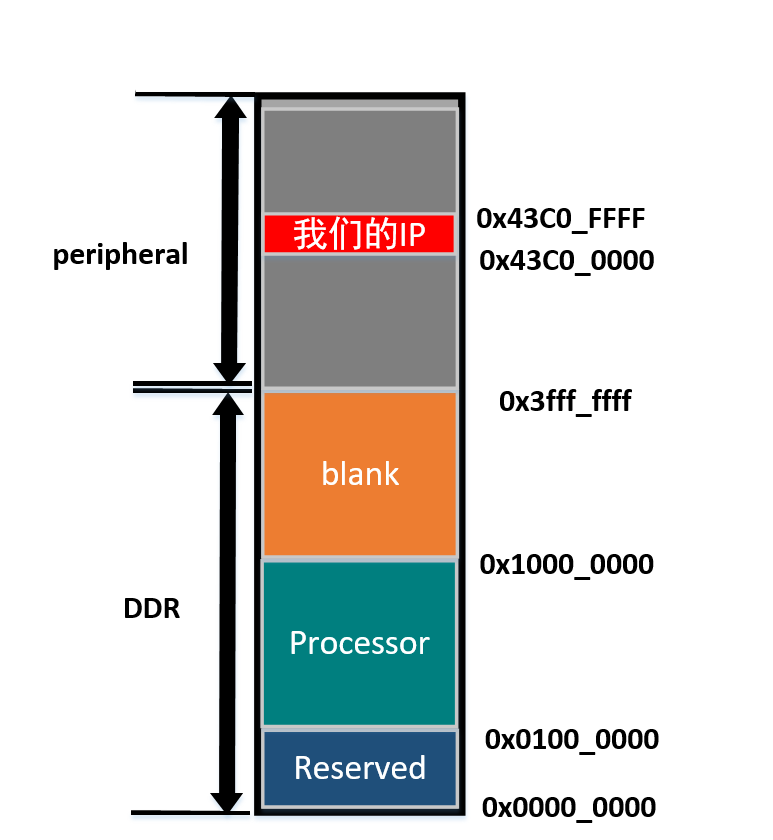

# S1 Lab03 Zynq中常用的IO控制(PS\PL)

## 1 实验介绍

在Zynq有着丰富的IO，但由于PS\_PL分开的特性，我们不能理所当然的使用任意一个IO端口。因此这里我们用PS和PL交互的形式去使用PL部分的IO。同时我们还需要了解一下GPIO\MIO\EMIO等知识。

.png>)

本小节将会：

通过自定义一个【IO\_controller IP核】去对PL上的IO：按钮、开关、以及LED进行一些控制，同时也是对上一个视频的温故知新。

同时也会在PS部分直接控制与PS相连接IO：按钮、LED

在本视频我们额外在说明一下上一个视频也许有同学没有搞懂的点：内存编址！

0x0000\_0000 -> 0x3fff\_ffff 占用0x40000000 => 2^(30) =>4GB(按字编址)/1GB(按字编址)

耐心听视频讲解吧\~

## 2 实验目标：制作IO控制器IP实现控制PL外设 & 直接控制PS端IO

#### 1. 制作IO控制器IP实现控制PL外设

#### 2. 直接控制PS端IO

## 3 实际实验步骤

暂缺，待补，详情步骤请见视频
