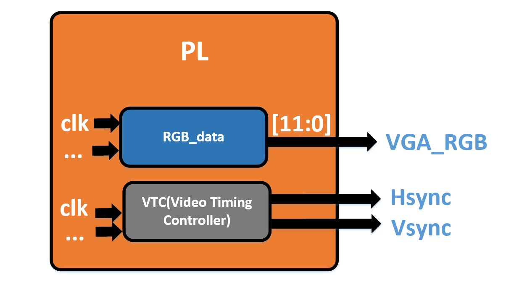

# S1 Lab04 VGA显示与VTC视频时序控制IP核

## Lab04 VGA显示与VTC视频时序控制IP核

### 1 实验介绍

在Zynq的PL部分中，有一个VGA接口，用于显示视频。VGA是一种视频信号的协议标准， 使用模拟信号的电脑显示标准 。

.png>)

关于VGA的基础概念我们会之后讲，但我在【FPGA图像处理】的系列视频的前8集已经详细解释并用Verilog实现了，所以若对VGA实现原理想搞通透的小伙伴不妨先看看那个视频，或者看完这个视频再去补一下。

我们的视频流输出是可以看作二维的，但我们每一帧所输出VGA每一时刻的视频数据都是有效的吗？

并不是！看下图：

.png>)

也就是说，我们要有几个信号（2个）来指示我们什么时候的数据是有效的，并且能够通过这些同步信号来进行行数和列数的判断。

我们可以手动用Verilog来写这些同步信号的逻辑（与你的分辨率是有关的），也可以通过现有的 Xilinx提供的IP：【Video Timing Controller】来进行时序信号的产生！

本小节将会：

通过使用【VTC IP核】和RGB\_data产生模块进行 图像数据通过VGA接口显示到显示器上！

### 2 实验目标：驱动VGA外设显示

#### 1. 在PL部分利用VTC驱动VGA外设进行显示

#### 【 VESA 1280x1024@60 Hz (pixel clock 108.0 MHz) 】

### 3 实际实验步骤

暂缺，待补，详情步骤请见视频

